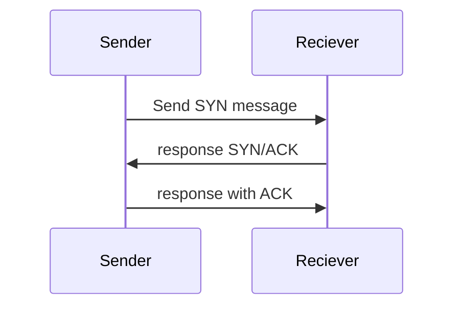

# mermaid-test
A simple test of the mermaid functionality of in GitHub render

## TCP three-way handshake

```mermaid
sequenceDiagram
    participant Sender
    participant Reciever
    Sender ->> Reciever: Send SYN message
    Reciever ->> Sender: response SYN/ACK
    Sender ->> Reciever: response with ACK

```